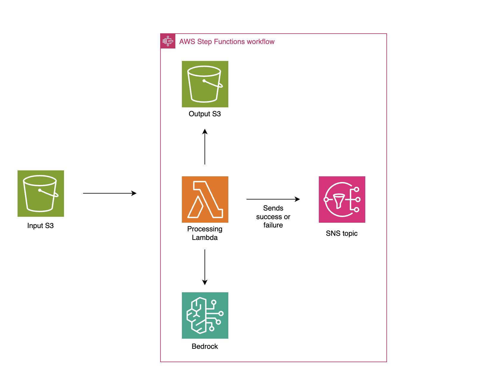

# Document Processing Pipeline

This is a simple pipeline that will intake Word docx files, and correct any spelling, grammar and tone mistakes before outputting a corrected version of the document. Messages will be sent so users can be updated when the document standardization process succeeds or fails. 

**Use case**: the customer wanted a solution where multiple ESL speakers could write documents in English using everyday language. Bedrock will update the casual tone of the documents to a business professional tone.

## How the Pipeline Works
1. A user updloads a .docx file to the S3 InputBucket and triggers a PutObject S3 notification
2. The PutObject S3 notification triggers an s3EventRule EventBridge rule
3. EventBridge starts the StepFunctions State Machine
4. The lambda function attemmpts to update the doc by:
    1. Using pandoc to transform the input word doc to html format. This keeps the formatting of the pictures, bullet points etc. so that the format of the doc is not changed after the text is passed to Bedrock.
    2. Passes the html-format text to Bedrock to fix any spelling / grammar mistakes. Bedrock will also update the tone so that the output doc is written in a business professional tone.
    3. Bedrock's output is transformed back into .docx format. The format of the original doc is preserved in the output doc thanks to the html formatting that was used in the intermediate step.
5. A success message is sent to subscribers of the SNS topic. If the lambda failed, a failure message is sent to the same SNS topic.



## Deploying the Solution
1. **If deploying locally, skip this step.** If using Cloud9, create a new environment in Cloud9 with an m5.large instance.
2. Clone the repo
    ```bash
    git clone https://github.com/nadhya-p/DocProcessing
    ```
3. Run the following commands: 

    ```bash
    cd DocStandardizationPipeline
    npm install
    cdk synth
    cdk deploy
    ```

## Create a template for the output doc
In the repo you will find a _customer-reference.docx_. This document contains the styling configuration for the documents that this pipeline will create. If you want to follow certain styling considerations (e.g. all text with header 2 styling has blue font color or a company logo should be in the header of every page) you can update _customer-reference.docx_ accordingly. 

**Note:** Any changes you make will need to be made via the Style panes tab of the Word docx. Just changing text size / color of the text will not work.

Once you have updated the _customer-reference.docx_ to your liking, upload it to the _docprocessingstack-inputbucket_ created by CloudFormation. If you do not want to make any changes, update this document to the input S3 bucket as-is.

## Subscribing to the SNS Topic
After the solution is deployed, an SNS topic will be created. Create a subscription to this topic using a protocol and endpoint of your choice. Make sure to confirm the subscription before testing the workflow.

## Request Access to Claude
If you have not already, request access to Claudev2.1 via the Amazon Bedrock Console.

## Triggering the Workflow
Upload a Word .docx file of your choice to the _docprocessingstack-inputbucket_ S3 bucket. If you do not have a doc ready for testing, you can use the included *tone_test.docx* file. The document will be processed and the corrected version will be added to the _docprocessingstack-outputbucket_. You will receive an SNS notification when this process is complete.

The current Bedrock prompt is updating the tone of the input doc (in our case the docs were written in a casual tone) so that all output documents are written in a business professional tone. 

## Assumptions
This workflow assumes the following:
* You are uploading a docx file
* You would like a docx file as your final output
* Your document has a Title and Subtitle, with no body text above them.
* If your document only has a title, update the ```extract_first_two_paragraphs(local_input_path)``` function accordingly.
* If your title is in Header 1 format, remove the following lines of code in the _processor.py_ file: 
    * ```title, subtitle = extract_first_two_paragraphs(local_input_path)```
    * ```subtitle_para = doc.paragraphs[0].insert_paragraph_before(subtitle, style='Subtitle')```
    * ```title_para = doc.paragraphs[0].insert_paragraph_before(title, style='Title')```
* You are using Bedrock models located in eu-central-1. If not, change the region in the _processor.py_ file.

## Changing Output Format
This project uses [pandoc](https://pandoc.org/) to create .html and .docx outputs. However, you can change your output file to be any file type that is supported by pandoc.

## Destroying the Stack
From the root directory run ```cdk destroy```. Any documents uploaded to the S3 buckets will be deleted when the stack is destroyed.