# Document Processing Pipeline

Automate your document processing: ingest Word files, translate content, correct language errors, and deliver polished output to S3 with real-time SNS status updates.

**Use case**: Organizations with multilingual teams often need a solution that allows non-native English speakers to create documents using everyday language. The goal is to enhance the grammar and tone of the original English documents while also providing translations into Spanish and French. This approach improves communication efficiency and ensures consistent messaging across multiple languages.

## How the Pipeline Works
1. A user updloads a .docx file to the S3 InputBucket and triggers a PutObject S3 notification.
2. The PutObject S3 notification triggers the *s3EventRule* EventBridge rule.
3. EventBridge starts the StepFunctions State Machine
    a. If the uploaded doc is *word_template.docx*, the *createS3folders* function will create S3 folder paths for the languages specified in  _createS3folder.py_. 
    b. The EventBridge rule will ignore any documents uploaded with the **'_translated.docx'** suffix, as these are the docs we create with the *translate.py* lambda.
4. The translate lambda determines the language of the original document based on which path the user uploaded the document to, and translates the document into the other languages specified in  _translate.py_.
5. The Bedrock lambda function attempts to update the doc by:
    1. Using mammoth to transform the input word doc to html format. This keeps the formatting of the pictures, bullet points etc. so that the format of the doc is not changed after the text is passed to Bedrock.
    2. Passes the html-format text to Bedrock to fix any spelling / grammar mistakes. Bedrock will also update the tone so that the output doc is written in a business professional tone.
    3. Bedrock's output is transformed back into .docx format. The format of the original doc is preserved in the output doc thanks to the html formatting that was used in the intermediate step.
6. The results of the map step of the Stepfunction machine will be aggregated in the aggregation lambda.
7. A success message is sent to subscribers of the SNS topic. If any part of the proccess failed, a failure message is sent to the same SNS topic.

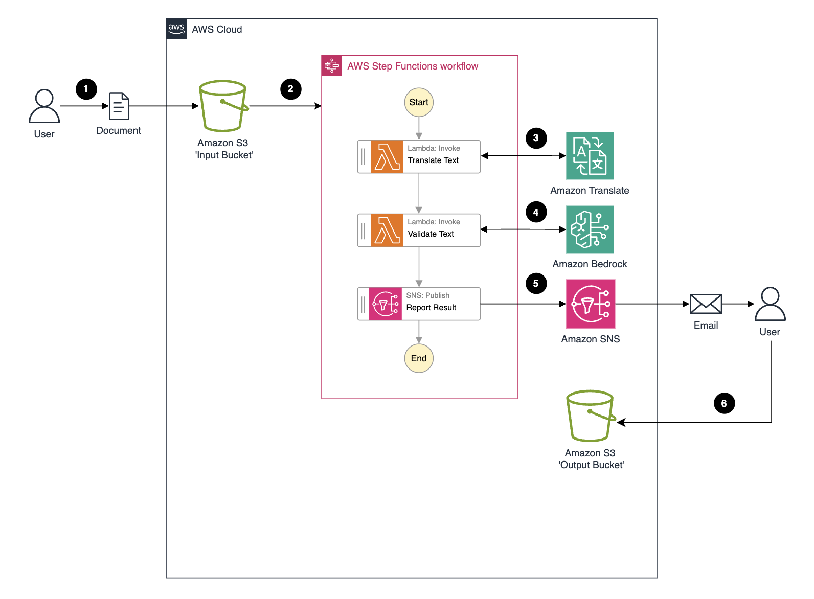

## License

This project is licensed under the [MIT-0 License](./LICENSE).

### Acknowledgments

This project depends on the following third-party libraries:

- [python-docx](https://github.com/python-openxml/python-docx) - Licensed under the [MIT License](https://opensource.org/licenses/MIT).
- [Mammoth](https://github.com/mwilliamson/python-mammoth) - Licensed under the [BSD 2-Clause License](https://opensource.org/licenses/BSD-2-Clause).
- [Beautiful Soup](https://www.crummy.com/software/BeautifulSoup/) - Licensed under the [MIT License](https://opensource.org/licenses/MIT).


## Assumptions
This workflow assumes the following:
* You are uploading a .docx file
* You would like a .docx file as your final output
* You are able to modify a .docx file on your computer.
* You are using Bedrock models located in us-east-1. If not, change the region in the _processor.py_ file

## Deploying the Solution
1. Clone the repo: ```git clone git@ssh.gitlab.aws.dev:nadhyap/bedrock-blog-post-doc-standardization-pipeline.git```
2. Run the following commands to deploy the stack 
``` sh
cd bedrock-blog-post-doc-standardization-pipeline
npm install
cdk bootstrap
cdk deploy
```

The stack will take about 3 minutes to deploy.

## Create & Upload a standard template for the output doc
In the repo you will find a *word_template.docx*. This document contains the styling configuration for the documents that this pipeline will create. If you want to follow certain styling considerations (e.g. all text with H2 styling has blue font color or a company logo should be in the header of every page) you can update *word_template.docx* accordingly. 

**Note:** Any styling changes you make will need to be made via the Style panes tab of the Word docx. Just changing text size / color of the text in the document will not work. 

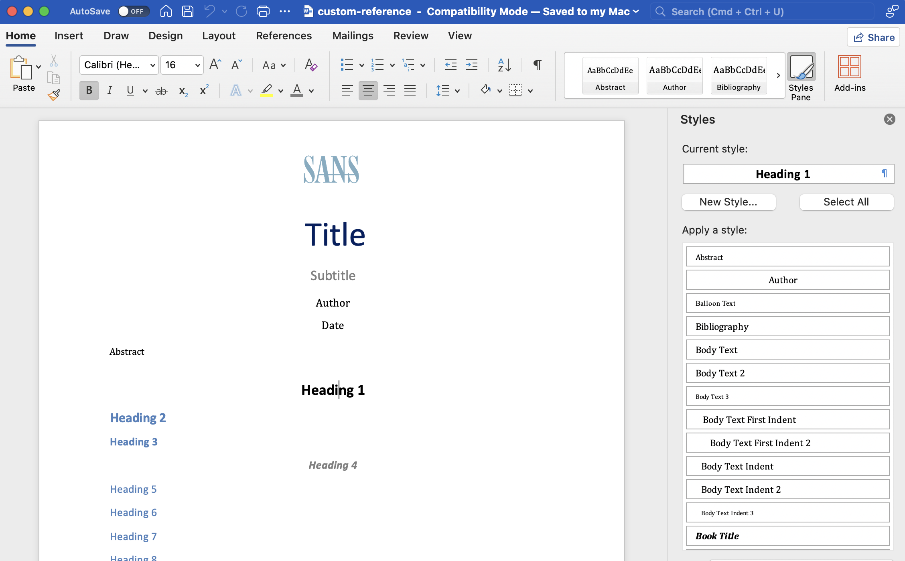

**Note** Anything that will be present in the output files (e.g. bullets, text, h2, etc.) needs to be defined in the *word_template.docx* file. For example, if the input doc has 4 levels of bullets, but the template file only has up to level 3 (as shown in the picture above), you would need to add Bullet List 4 (or Number List 4) to the template file and re-upload it to *docstandardizationstack-inputbucket*.


Once you have updated the *word_template.docx* to your liking, **upload it to the *docstandardizationstack-inputbucket* created by CloudFormation**. If you do not want to make any changes, upload this document to the input S3 bucket as-is. Your output documents will follow the formatting specified in *word_template.docx*, regardless of the input format. For example, if your original document has H1 text in black, bold letters but *word_template.docx* specifies that H1 text should be blue and italic, the output doc will have H1 text in blue and italic.

When *word_template.docx* is uploaded for the first time, english, spanish and french path folders will automatically be created in the input bucket.

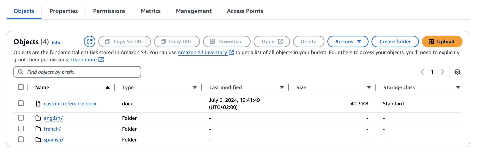

If you would like to change the folder names, follow the instructions in the [*Updating the languages*](#updating-the-languages) section of this README. 

## Subscribing to the SNS Topic
During deployment, 2 SNS topics will be created. Create a subscription to the *DocStandardizationStack-ResultTopic* topic using a protocol and endpoint of your choice. The below examples show how to create an email subscription to your SNS topic.

If using the console, click on "Create subscription" and pick the endpoint of your choice.

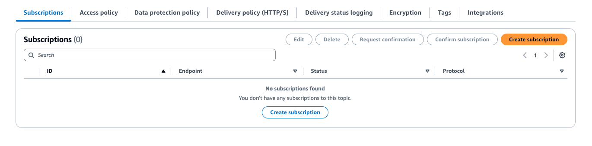

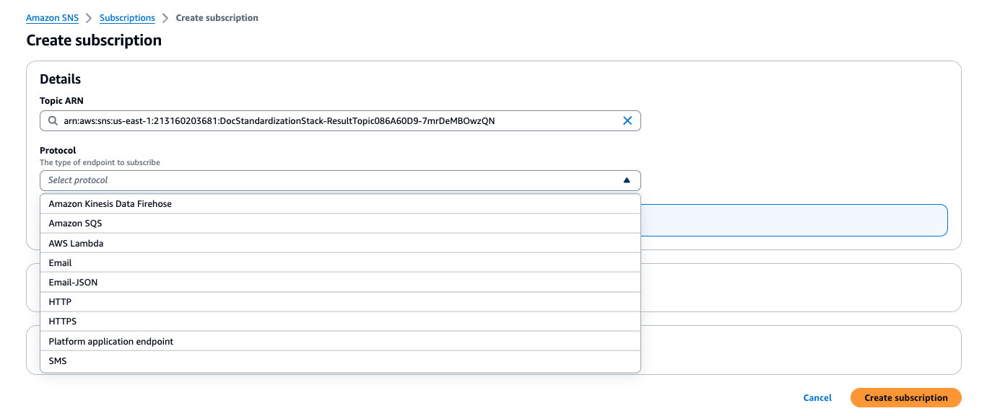

If using the CLI, use the following notation to subscribe:
``` sh
aws sns subscribe \
    --topic-arn arn:aws:sns:us-east-1:my-account:DocStandardizationStack-ResultTopic... \
    --protocol email \
    --notification-endpoint my-email@example.com
```

**Make sure to confirm the subscription *before* testing the workflow.**


## Request Access to Claude
If you have not already, request access to Claude 3 Sonnet via the Amazon Bedrock Console. The *bedrock_processory.py* function is currently calling the Claude model from the us-east-1 region, so you will need to request Claude 3 Sonnet access in the us-east-1 region. If you would like to call a model from a different region instead, update the **region** variable in *bedrock_processor.py* and request model access in your chosen region.

There is no cost associated with requesting model access. You will only be charged based on the Bedrock consumption you use.

## Triggering the Workflow
**Before triggering the workflow, please ensure that you have already uploaded *word_template.docx***

Upload a Word .docx file of your choice to the _docstandardizationstack-inputbucket_ S3 bucket. Upload the document in the folder of the original document language. For example, if your document is written in English, upload it in the _english/_ folder.

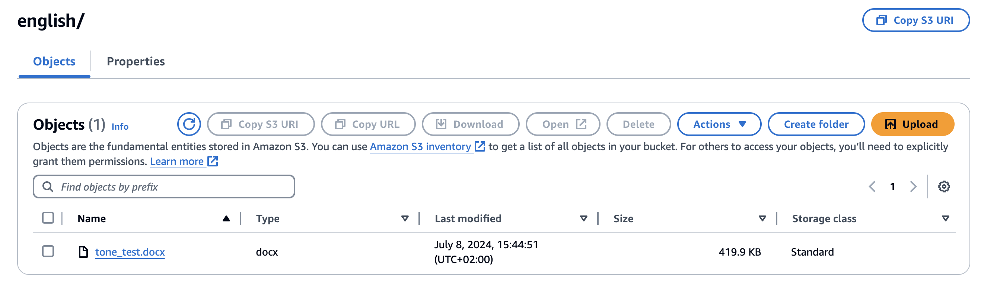

If you do not have a doc ready for testing, you can use the included *tone_test.docx* file. The document will be translated to all specified languages (except the original language of the document), and the translated documents will be added to the corresponding folders in the input bucket with a '_translated' prefix. 

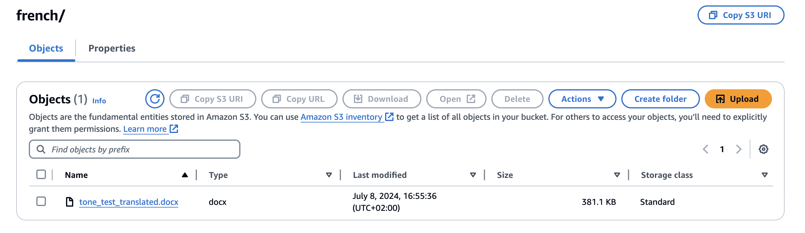

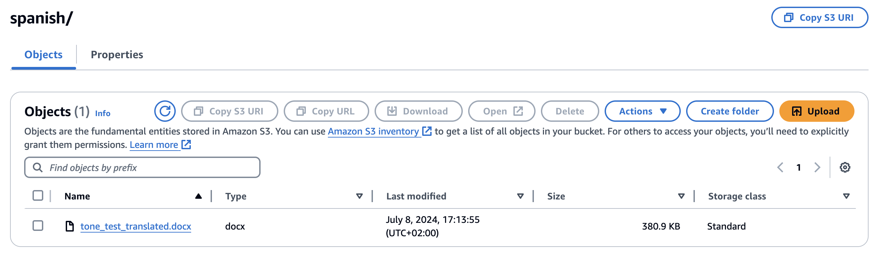


### Output Documents

The documents will then be processed with Bedrock and the corrected version will be added to the _docstandardizationstack-outputbucket_. The output bucket has the same format as the input bucket.

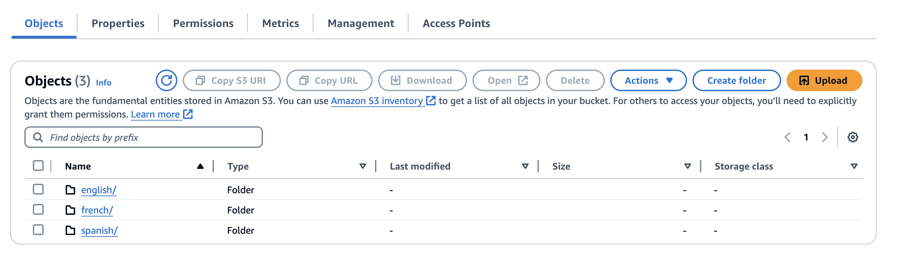

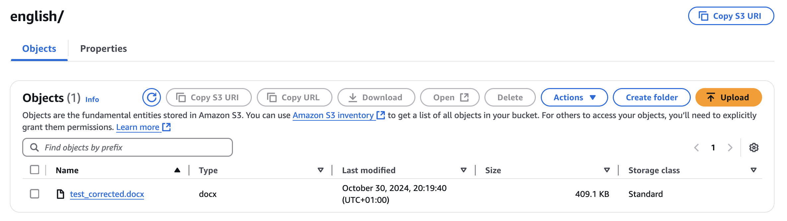

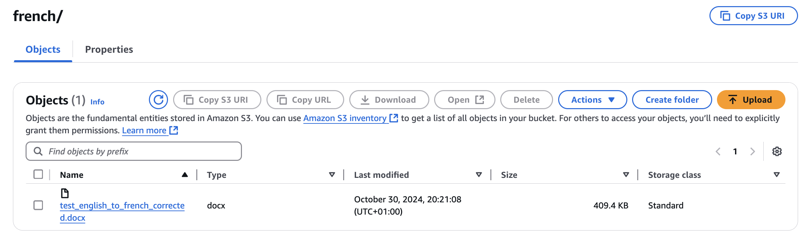

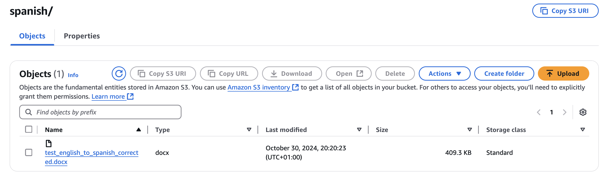


You will also receive an SNS notification when this process is complete.

As a safety measure, the EventBridge rule that starts this workflow will be deleted if the StepFunction state machine is triggered more than 5 times in 5 minutes. You can increase this limit by updating the 'threshold' property of the **alarm** variable in _doc-processing-stack.ts_. If you do increase the threshold, be sure to save your changes before running `cdk deploy` to push the changes to the deployed stack.


## Updating the languages
If you'd like to add languages to the solution, update the __exitPaths__ variable in _doc-processing-stack.ts_ to add your languages of choice. You will also need to update the __LANGUAGE_FOLDERS__ and __LANGUAGE_CODES__ variables in _translate.py_, as well as the Bedrock model prompt in *claude_prompt.py*.

If you would like to change the intial folder names on creation, update _createS3folder.py_ as well.

**When updating the languages, please follow ALL of the steps above before testing the workflow.** 


## Destroying the Stack
1. From the root directory run ```cdk destroy```. **Any documents uploaded to the inputBucket will be deleted when the stack is destroyed.**
2. Delete the *docstandardizationstack-mys3trails* S3 bucket that was created. This can be done via the console or by running the following commands from your terminal:
 ``` sh
 aws s3 rm s3://bucket-name --recursive
 aws s3 rb s3://bucket-name
```

