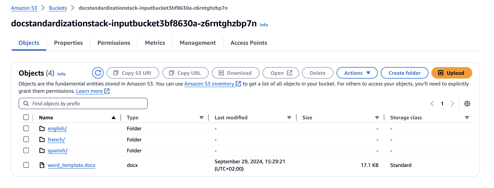
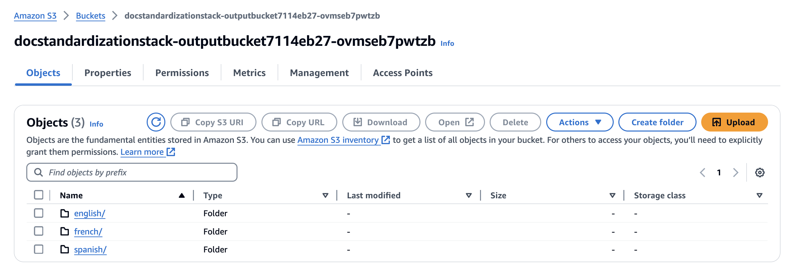

# Document Processing Pipeline (UPDATE IN PROGRESS)

This is a simple pipeline that will intake Word docx files and translate them before correcting any spelling, grammar and tone mistakes. A corrected version of the document will be added to an output S3 bucket. Messages will be sent so users can be updated when the document standardization process succeeds or fails. 

**Use case**: the customer wanted a solution where multiple ESL speakers could write documents in English using everyday language. The customer wanted to improve the grammar and tone of the original documents, while also translating the documents to Spanish and French.

## How the Pipeline Works
1. A user updloads a .docx file to the S3 InputBucket and triggers a PutObject S3 notification
2. The PutObject S3 notification triggers an s3EventRule EventBridge rule
3. EventBridge starts the StepFunctions State Machine
    a. If the uploaded doc is _custom-reference.docx_, the _createS3folders_ function will create the specified S3 folder paths. The creation of the S3 language paths will trigger the Stepfunction state machine again, but the workflow will immediately go to the succeeded state.
    b. The EventBridge rule will ignore any documents uploaded with the **'-translated.docx'** suffix, as these are the docs we create with the translate lambda.
4. The translate lambda determines the language of the original document based on which path the user uploaded the document to, and translates the document into the other specified languages.
5. The bedrcok lambda function attemmpts to update the doc by:
    1. Using pandoc to transform the input word doc to html format. This keeps the formatting of the pictures, bullet points etc. so that the format of the doc is not changed after the text is passed to Bedrock.
    2. Passes the html-format text to Bedrock to fix any spelling / grammar mistakes. Bedrock will also update the tone so that the output doc is written in a business professional tone.
    3. Bedrock's output is transformed back into .docx format. The format of the original doc is preserved in the output doc thanks to the html formatting that was used in the intermediate step.
6. The results of the map step of the Stepfunction machine will be aggregated in the aggregation lambda.
7. A success message is sent to subscribers of the SNS topic. If any part of the proccess failed, a failure message is sent to the same SNS topic.

UPDATE ARCH


## Deploying the Solution
1. **If deploying locally, skip this step.** If using Cloud9, create a new environment in Cloud9 with an m5.large instance.
2. Clone the repo
    ```bash
    git clone git@ssh.gitlab.aws.dev:nadhyap/bedrock-blog-post-doc-standardization-pipeline.git
    ```
3. Run the following commands: 

    ```bash
    cd document-standardization-pipeline
    npm install
    cdk bootstrap
    cdk deploy
    ```

## Create a template for the output doc
In the repo you will find a _custom-reference.docx_. This document contains the styling configuration for the documents that this pipeline will create. If you want to follow certain styling considerations (e.g. all text with header 2 styling has blue font color or a company logo should be in the header of every page) you can update _custom-reference.docx_ accordingly. 

**Note:** Any changes you make will need to be made via the Style panes tab of the Word docx. Just changing text size / color of the text will not work.

Once you have updated the _custom-reference.docx_ to your liking, upload it to the _docprocessingstack-inputbucket_ created by CloudFormation. If you do not want to make any changes, update this document to the input S3 bucket as-is. When _custom-reference.docx_ is uploaded for the first time, /english, /spanish and /french path prefixes will be created in the bucket.



If you would like to change the folder names, edit the folders in _createS3Folders.py_

## Subscribing to the SNS Topic
After the solution is deployed, an SNS topic will be created. Create a subscription to this topic using a protocol and endpoint of your choice. Make sure to confirm the subscription before testing the workflow.

## Request Access to Claude
If you have not already, request access to Claude Sonnet via the Amazon Bedrock Console.

## Triggering the Workflow
Upload a Word .docx file of your choice to the _docprocessingstack-inputbucket_ S3 bucket. Upload the document in the folder of the original document language. For example, if your document is written in English, upload it under /english.


If you do not have a doc ready for testing, you can use the included *tone_test.docx* file. The document will be translated to all languages (excpet the original language of the document), and the translated documents will be added to the corresponding folders in the input bucket with a '_translated' prefix. 


The documents will then be processed with Bedrock and the corrected version will be added to the _docprocessingstack-outputbucket_. The output bucket has the same format as the input bucket.




You will also receive an SNS notification when this process is complete.


## Updating the languages
If you'd like to add languages to the solution, update the __exitPaths__ variable in _doc-processing-stack.ts_ to add your languages of choice. You will also need to update the __LANGUAGE_FOLDERS__ and __LANGUAGE_CODES__ variables in _translate.py_, as well as the Bedrock model prompt in *claude_prompt.py*.

## Assumptions
This workflow assumes the following:
* You are uploading a docx file
* You would like a docx file as your final output
* Your document title is in H1 format. 
* You are using Bedrock models located in us-east-1. If not, change the region in the _processor.py_ file.


If your document is setup with Titles and Subtitle formatting (rather than H1 for the title), follow the steps below:
* If your document only has a title, update the ```extract_first_two_paragraphs(local_input_path)``` function accordingly.
* If your document title is not in Header 1 format, uncomment the following lines of code in the _processor.py_ file: 
    * ```title, subtitle = extract_first_two_paragraphs(local_input_path)```
    * ```subtitle_para = doc.paragraphs[0].insert_paragraph_before(subtitle, style='Subtitle')```
    * ```title_para = doc.paragraphs[0].insert_paragraph_before(title, style='Title')```

## Changing Output Format
This project uses [pandoc](https://pandoc.org/) to create .html and .docx outputs. However, you can change your output file to be any file type that is supported by pandoc.

## Destroying the Stack
From the root directory run ```cdk destroy```. Any documents uploaded to the S3 buckets will be deleted when the stack is destroyed.